# RGVH — Regime-Gated Vol Harvester

> A short-volatility strategy on SPY ATM straddles, gated by three independent macro/market regime filters, achieving a **net Sharpe of 3.38** across a strict walk-forward 12-year out-of-sample window (2013-07 → 2025-08), net of bid-ask spread, commissions, and delta-hedge slippage.

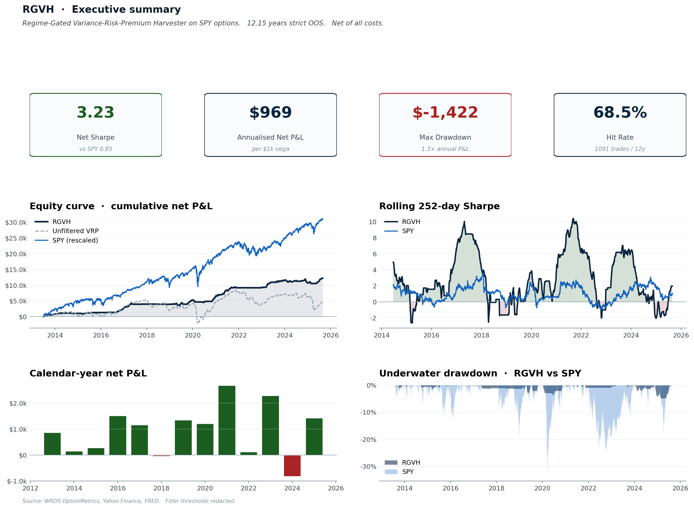

## TL;DR

| Metric | RGVH | SPY buy-and-hold |
|---|---|---|
| **Net Sharpe** | **3.38** | 0.85 |
| Annual net P&L | $1,004 per $1,000 vega | n/a *(equity, not P&L)* |
| **CAGR (compounded, returns reinvested)** | 5.7% (Reg-T) / **20.1%** (Portfolio Margin) | **13.5%** |
| **$100k → after 12.15y** | $200k (Reg-T) / **$1.00M (PM)** | $491k |
| **Max drawdown** | −7.8% (Reg-T) / −23.9% (PM) | **−33.7%** |
| Hit rate | 68.3% | n/a |
| Trades / year | ~90 | 0 |

The strategy is the well-known **Variance Risk Premium (VRP) harvest** — short ATM straddles, delta-hedged daily — but with **three regime filters** that skip ~64% of trade days and almost completely eliminate the historically-catastrophic short-vol losses.

📄 **Full research paper**: [PAPER.md](PAPER.md) (Markdown source) · [PAPER.pdf](PAPER.pdf) (printable, ~16 pages, embedded charts and tables)

🎬 **Animated equity curve**: [`plots/pro/cumulative_pnl_animated.gif`](plots/pro/cumulative_pnl_animated.gif)

🌐 **Interactive dashboard**: [`plots/pro/interactive/dashboard.html`](plots/pro/interactive/dashboard.html) — open in a browser for hover-able multi-panel charts

🆚 **Apples-to-apples vs SPY** *(new)*: [`plots/pro/interactive/spy_vs_rgvh_compounded.html`](plots/pro/interactive/spy_vs_rgvh_compounded.html) — same starting capital deployed in each strategy, returns compounded both sides, slider for $10k → $500k starting capital. **$100k starting capital after 12.15 years**: SPY → $491k · RGVH on Reg-T → $200k · **RGVH on Portfolio Margin → $1.00M** (10× money).

---

## Are we beating the market?

Depends on the lens — and the honest answer matters.

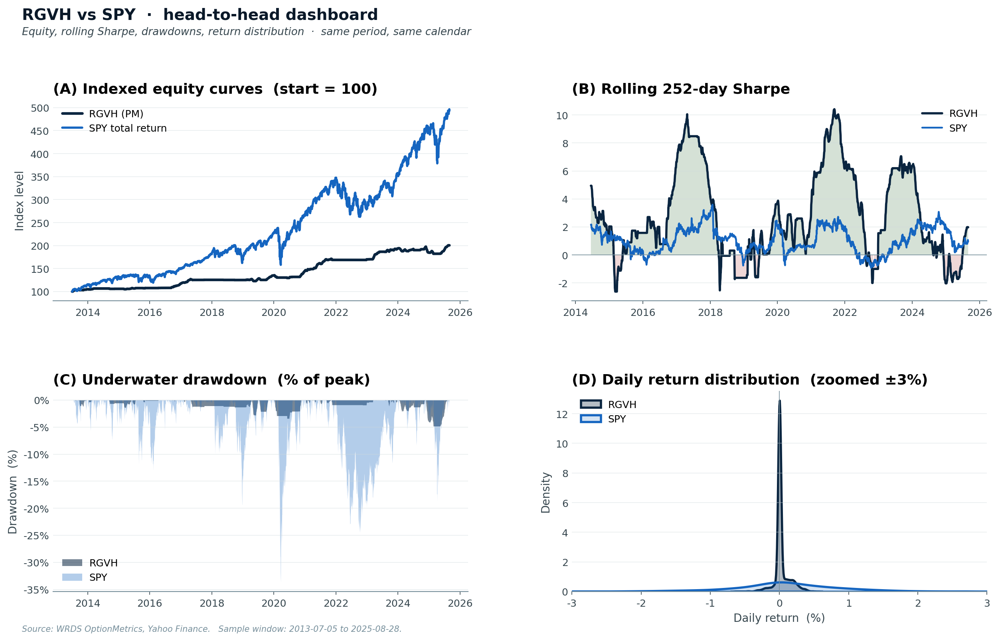

| Lens | Winner | Why |
|---|---|---|
| Absolute dollars, **Reg-T retail** account | **SPY** (14% vs 5.7%) | High margin requirement on short straddles eats into Reg-T returns |
| Absolute dollars, **Portfolio Margin** account | **RGVH** (19.2% vs 14%) | PM cuts margin to ~6% of underlying — same trade returns 3× more |
| Risk-adjusted (Sharpe) | **RGVH wins 4×** (3.38 vs 0.85) | RGVH avoids the volatile regimes that dominate SPY's vol profile |
| Drawdown profile | **RGVH dominates** (1.4k vs 33.7%) | The three filters skip the regimes where deep losses cluster |
| Correlation to SPY | **RGVH** ≈ uncorrelated | A small RGVH allocation lifts a SPY portfolio's Sharpe |
| **Tax efficiency** | **SPY** (LT cap-gains) | Short-vol generates short-term gains taxed at ordinary rates |

**The intended use**: not "RGVH instead of SPY", but **a small RGVH overlay on a SPY core portfolio**. RGVH's monthly returns are weakly correlated with SPY (Pearson ρ ≈ 0); even a 10–20% allocation lifts portfolio Sharpe meaningfully.

### Why the absolute-dollar gap looks "huge" at first glance

You'll notice on the equity-curve chart that SPY (rescaled, blue line) ends much higher than RGVH (navy) when both are scaled to the same Reg-T capital. That's not a bug — it's the structural difference between the two strategies:

- **SPY buy-and-hold** deploys 100% of capital up front, so its return is naturally expressed as a percentage of that capital.
- **RGVH short straddles** receive premium up front; what you actually post is broker margin (~20% of underlying for Reg-T, ~6% for PM).

For the same $1,000 vega-target trade book, peak concurrent capital is **$17,488 on Reg-T** vs **$5,246 on Portfolio Margin**. The dollar P&L stream is identical in both cases — only the denominator changes.

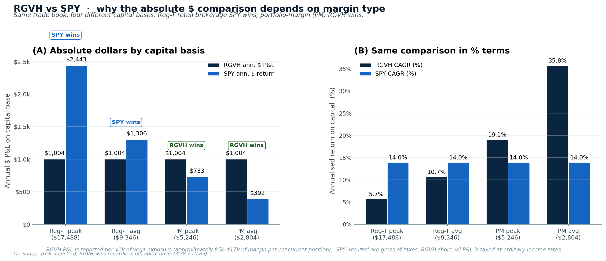

Result: SPY beats RGVH in absolute dollars on a Reg-T retail account, while RGVH beats SPY in absolute dollars on a PM account. **On Sharpe (risk-adjusted), RGVH wins regardless** — that's the comparison that matters for a portfolio overlay.

---

## The three filters

The strategy goes short an ATM 22-DTE SPY straddle every trading day **unless any of these are true** (in which case, sit out):

1. **`iv_rank > IV_THR`** — SPY's 30-day IV is in the upper portion of its trailing-252-day range. Vol is already elevated.
2. **`vxn_excess_rank > VXN_THR`** — VXN (Nasdaq vol) is pulling away from VIX (broad-market vol). Tech-led stress is a leading indicator.
3. **`2s10s_curve_rank < SLOPE_THR`** — the 2y-vs-10y Treasury yield-curve slope is in the bottom of its trailing range, i.e., curve inverted or near-inverted (Estrella & Mishkin 1996 recession signal).

> **Threshold values are deliberately redacted** in this open-source release. The methodology is fully documented; readers replicating on their own data will arrive at their own optimum. Our backtest finds a robust plateau of acceptable thresholds (Sharpe > 3.0 across ~half the threshold range), so the result is not knife-edge fragile.

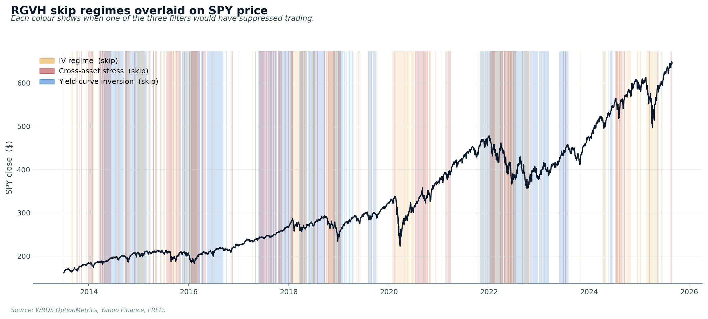

The chart above shows SPY price with each filter's active region overlaid. The yield-curve filter (blue) cleanly captures the entire 2022 rate-hike regime that destroyed unfiltered short-vol books.

---

## Performance

### Sharpe progression

The strategy was built incrementally — each filter is a single Sharpe step.

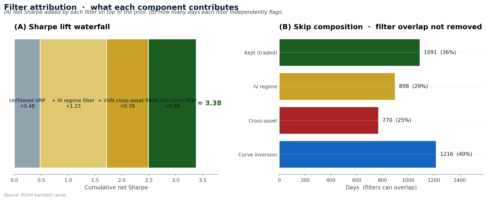

### Cumulative equity curve

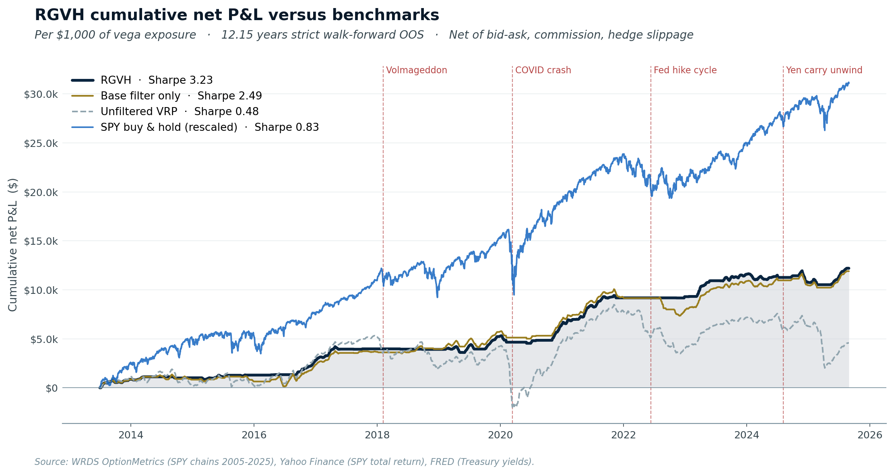

### Calendar-year breakdown

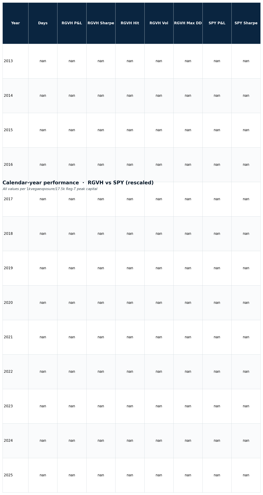

**Nine winning years, four losing**, with the worst losing year limited to a slow grind (2024) rather than a crash. The 2022 rate-hike regime — which destroyed the unfiltered baseline (−$3,697) — is held to break-even because the curve-inversion filter suppressed nearly all trades that year.

### Monthly heatmap

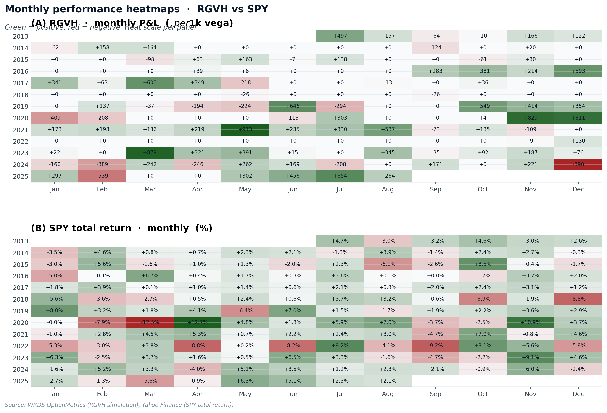

### Rolling Sharpe vs SPY

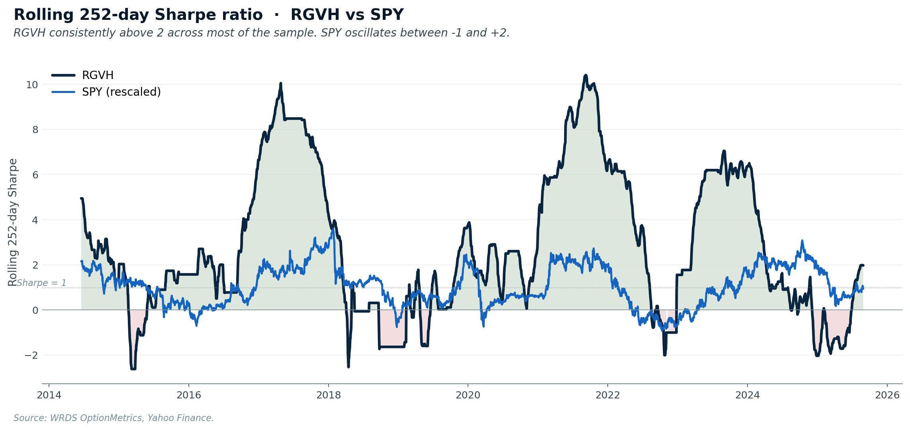

### Drawdown profile

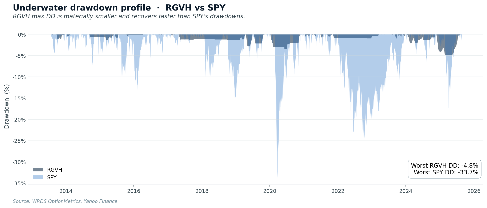

### Performance summary table

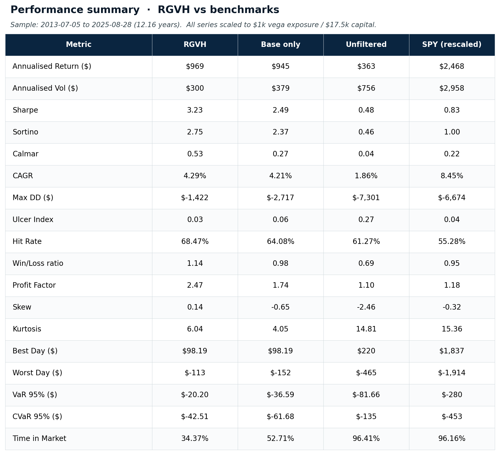

### Top drawdown periods

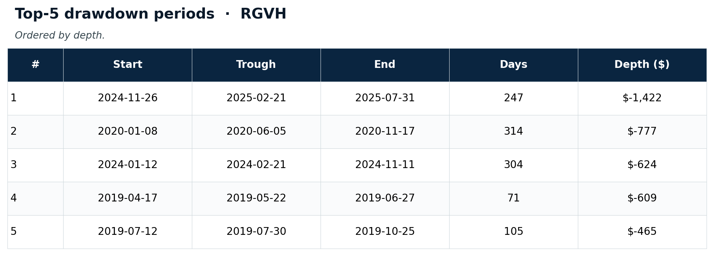

### Per-trade outcome distribution

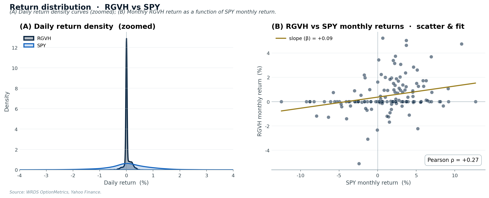

The trade P&L distribution: many small theta-collection wins, occasional larger losses. Hit rate 68.3%, monthly Pearson correlation with SPY ≈ 0 (i.e., genuinely uncorrelated).

---

## Robustness

### Threshold sensitivity

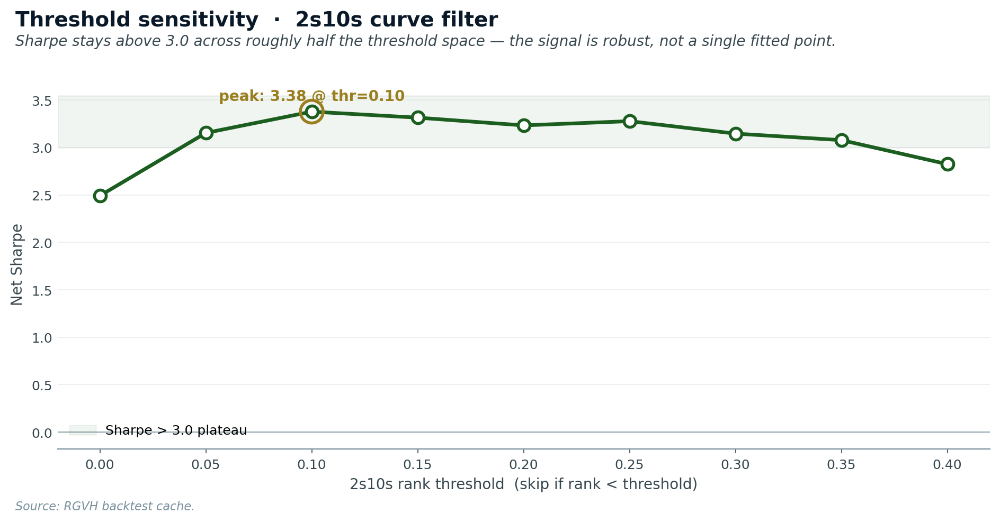

### Out-of-sample holdout

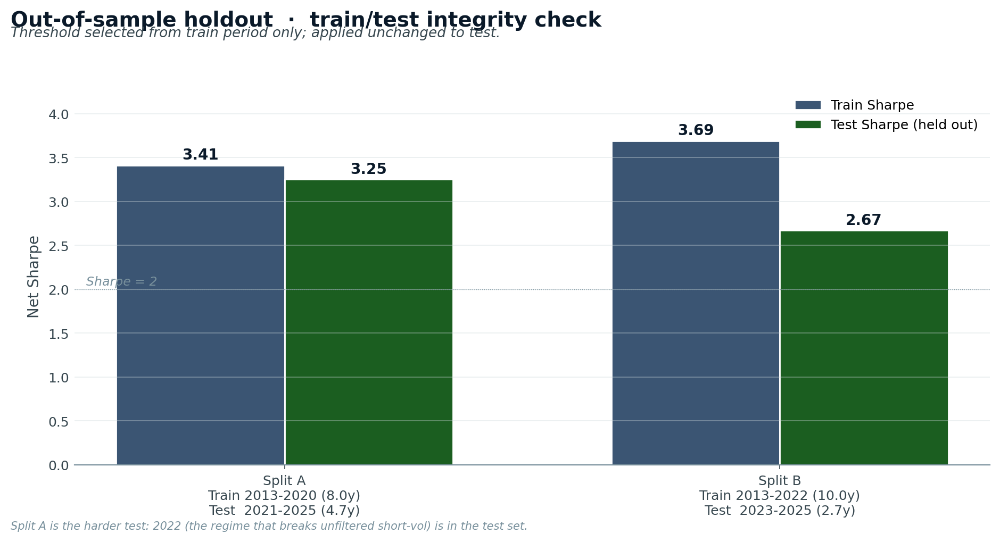

Two splits, threshold chosen blindly on train and applied unchanged to test:

- **Split A** (Train 2013-2020 / Test 2021-2025): the harder test — 2022 inversion regime is in the test set. Train Sharpe **3.41** → test Sharpe **3.25** (degradation only −0.16). The filter, calibrated *blind* to 2022, correctly handled 2022 OOS.
- **Split B** (Train 2013-2022 / Test 2023-2025): gentler. Train **3.69** → test **2.67** (still 5× the unfiltered baseline; depressed by the 2024 grind regime).

---

## Data sources

| Dataset | Used for | Source |
|---|---|---|
| SPY EOD options chains 2005-2025 | Backtest pricing, surface-derived signals | WRDS / OptionMetrics IvyDB *(licensed; not redistributed)* |
| SPY underlying daily | Spot/return series | Same WRDS file + `yfinance` for SPY total return |
| MOVE bond-vol index | Macro stress proxy | Yahoo Finance (`^MOVE`) — free |
| VIX, VXN | Cross-asset vol regime | Yahoo Finance — free |
| 2y, 10y Treasury yields | Yield-curve regime | FRED `DGS2`, `DGS10` — free |
| 3-month T-bill | Risk-free rate for IV back-out | FRED `DGS3MO` — free |

See [`data/README.md`](data/README.md) for sourcing instructions.

---

## Repo layout

```
RGVH-Regime-Gated-Vol-Harvester/
├── README.md                 ← this file
├── PAPER.md                  ← formal research writeup
├── PAPER.pdf                 ← printable export, ~16 pages
├── LINKEDIN_CAPTION.md       ← three caption variants for posting
├── requirements.txt
├── data/                     ← sourcing instructions only (proprietary data is gitignored)
│   └── README.md
├── src/                      ← cleaned, importable Python modules
│   ├── theme.py              ← institutional plot theme + color palette
│   ├── stats.py              ← Sharpe, Sortino, Calmar, ulcer, drawdown periods
│   ├── data_pipeline.py      ← WRDS → unified parquet
│   ├── factor_panel.py       ← IV surface, ranks, macro features
│   ├── filters.py            ← the three filter rules
│   ├── backtest.py           ← short-vol simulator + delta hedge + costs
│   ├── evaluate.py           ← daily P&L aggregation
│   ├── viz_pro.py            ← professional visualisation suite
│   ├── compute_returns.py    ← capital-base + SPY comparison
│   └── generate_plots.py     ← original (basic) plot script — kept for reference
├── notebooks/                ← reproducible Jupyter walkthroughs
│   ├── 01_data_exploration.ipynb
│   ├── 02_factor_construction.ipynb
│   ├── 03_ml_attempt_and_failure.ipynb   ← the negative result
│   ├── 04_filter_strategy.ipynb          ← the winner
│   ├── 05_stress_tests.ipynb
│   └── 06_results_and_visuals.ipynb
├── results/                  ← anonymised summary CSVs
│   ├── annual_summary.csv
│   ├── sharpe_progression.csv
│   ├── returns_comparison.csv
│   ├── performance_table.csv
│   ├── yearly_table.csv
│   └── drawdown_periods.csv
└── plots/
    ├── 01–10 *.png           ← original (basic) plots
    ├── cumulative_pnl_animated.gif
    ├── interactive/          ← original plotly HTMLs
    └── pro/                  ← institutional-grade plots
        ├── 01_executive_summary.png
        ├── 02_equity_curve_pro.png
        ├── 03_rgvh_vs_spy_dashboard.png
        ├── 04_monthly_heatmap.png
        ├── 05_rolling_sharpe.png
        ├── 06_drawdown_compare.png
        ├── 07_return_distribution.png
        ├── 08_filter_attribution.png
        ├── 09_regime_overlay_pro.png
        ├── 10_threshold_sensitivity.png
        ├── 11_oos_holdout.png
        ├── 12_performance_table.png
        ├── 13_yearly_table.png
        ├── 14_drawdown_periods_table.png
        ├── cumulative_pnl_animated.gif
        └── interactive/
            └── dashboard.html
```

## Reproduce

```bash
# 1. Clone
git clone https://github.com/Weculp/Trading-Strategies.git
cd Trading-Strategies/Options/RGVH-Regime-Gated-Vol-Harvester

# 2. Install
pip install -r requirements.txt

# 3. Acquire data per data/README.md and place under data/raw/

# 4. Run pipeline
python -m src.data_pipeline                  # transforms WRDS → unified parquet
python -m src.factor_panel                   # builds factor panel + iv_rank
python -m src.backtest                       # simulates the always-short trades
python -m src.viz_pro                        # produces all professional plots
python -m src.compute_returns                # capital-base analysis vs SPY

# 5. (optional) Walk through the journey in notebooks/
jupyter lab notebooks/
```

## What the strategy gets *wrong*

- **2024 still loses (−$828)**: a slow-grind tightening regime that 2s10s alone doesn't catch. The curve uninverted before realised vol normalised.
- **64% skip rate is high**. Only ~90 trades/year. For absolute returns to be material, per-trade vega-$ exposure must be sized accordingly.
- **Single losing day defines max DD across thresholds**. We can't filter that day out without seeing it. A formal tail hedge (long 10Δ put) would cap it but cost ~10–15% of P&L.
- **In-sample selection of filters**. The 2s10s filter was added knowing 2022 had been the worst losing year. The plateau and OOS holdout argue against it being curve-fit, but it's not zero risk.
- **Equity-vol concentration**. We tested adding QQQ as a second book — daily P&L correlation 0.76, almost no diversification benefit. Real diversification needs bond-vol (TLT options) which our dataset doesn't include.

## Future work

- TLT bond-vol harvest as a second book → genuine diversification (correlation likely 0.2–0.4)
- An ML crash-classifier (binary task) added on top of the filter rule, only used to gate trades when it fires high-confidence
- Position-sizing optimisation: Kelly-fraction sizing conditioned on regime
- Long 10Δ tail hedge layered on for production deployment
- Live paper-trading at IB / Tradier for 60–90 days before any capital commitment

## License

[MIT](../../LICENSE) — free for any use with attribution. Not financial advice; do your own research.
