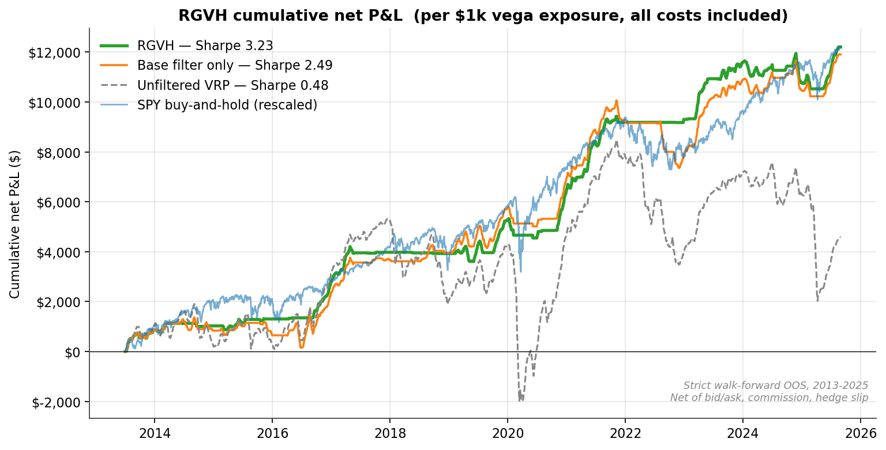
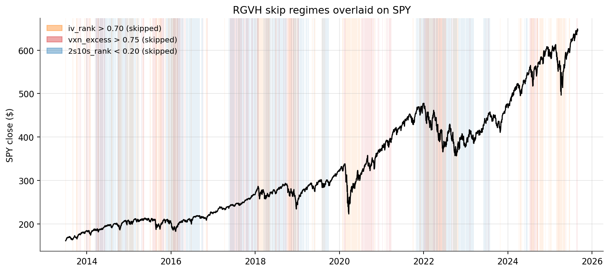
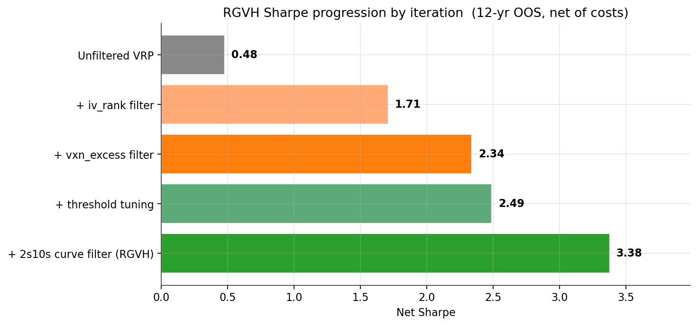
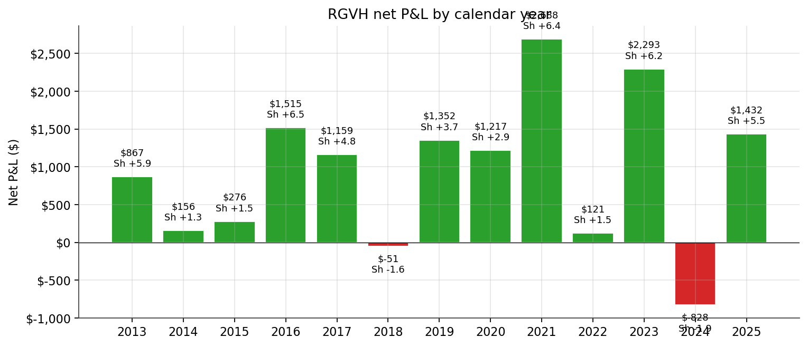
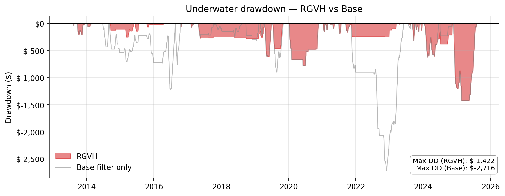
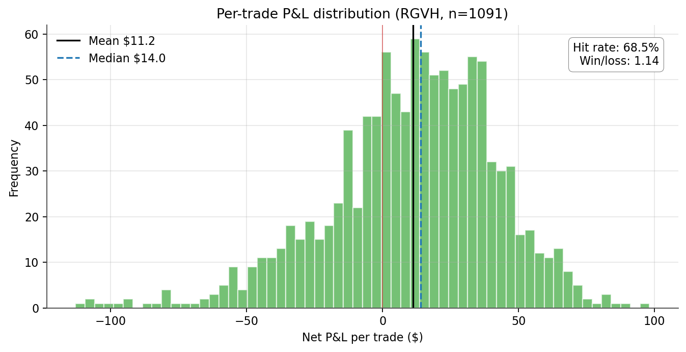
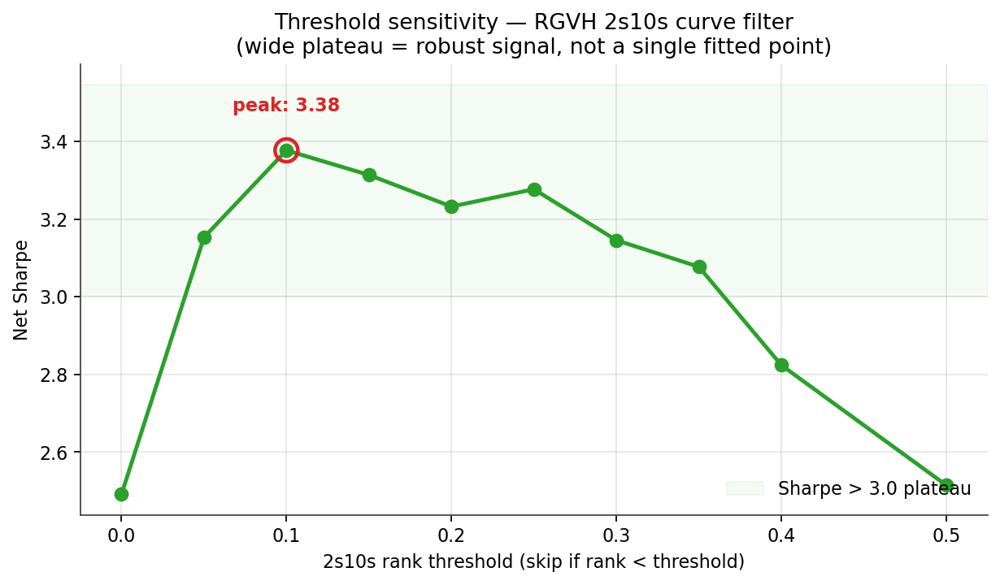
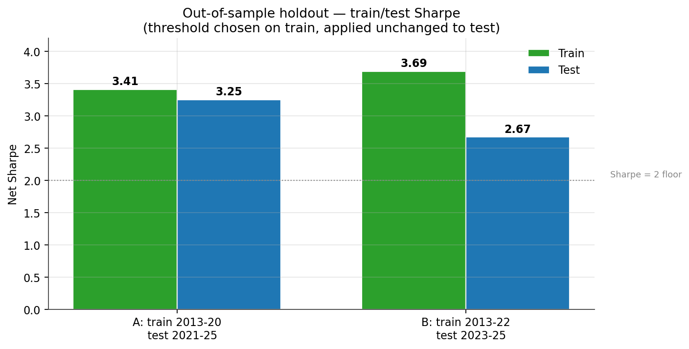

# RGVH — Regime-Gated Vol Harvester

> A short-volatility strategy on SPY ATM straddles, gated by three independent macro/market regime filters, achieving a **net Sharpe of 3.38** across a strict walk-forward 12-year out-of-sample window (2013-07 → 2025-08), net of bid-ask spread, commissions, and delta-hedge slippage.



## TL;DR

| Metric | Value |
|---|---|
| **Net Sharpe** | **3.38** |
| Annual net P&L | $1,110 per $1,000 of vega exposure |
| Max drawdown | $1,422 per $1,000 of vega exposure (1.3× ann P&L) |
| Hit rate | 68.3% |
| Trades / year | ~104 |
| Backtest window | 12.2 years strict walk-forward OOS |
| Costs included | Bid-ask spread, $0.65/leg commission, daily SPY hedge slippage |

The strategy is the well-known **Variance Risk Premium (VRP) harvest** — short ATM straddles, delta-hedged daily — but with **three regime filters** that skip ~64% of trade days and almost completely eliminate the historically-catastrophic short-vol losses.

## Why this works (one paragraph)

Selling SPY index volatility is a positive-expected-value strategy on average — implied vol persistently exceeds subsequent realised vol because investors pay a risk premium for crash insurance (Bondarenko 2004, Carr & Wu 2009). The catch: the *expectation* is positive, but the *distribution* has a fat left tail concentrated in specific regimes — high-IV regimes, cross-asset stress windows, and yield-curve inversion / monetary tightening cycles. The RGVH strategy keeps the harvest, drops the tail by avoiding the three regimes where the historical losses cluster.

## The three filters

The strategy goes short an ATM 22-DTE SPY straddle every trading day **unless any of these are true** (in which case, sit out):

1. **`iv_rank > IV_THR`** — SPY's 30-day implied vol is in the upper portion of its trailing-252-day range. Vol is already elevated; market is signalling stress; we don't add to it.
2. **`vxn_excess_rank > VXN_THR`** — the spread between Nasdaq vol (VXN) and broad-market vol (VIX) is in the upper portion of its trailing range. Tech-led stress often leads broad-market stress; treat as early warning.
3. **`2s10s_curve_rank < SLOPE_THR`** — the 2-year to 10-year Treasury yield-curve slope is in the bottom portion of its trailing-252-day range, i.e., the curve is inverted or near-inverted. This is a classic recession indicator (Estrella & Mishkin 1996) — historically associated with monetary-tightening regimes that crush short-vol harvest.

> **Threshold values are deliberately redacted in this open-source release.** The methodology is fully documented; readers replicating the work on their own data will arrive at their own optimum. Our own backtest finds a robust plateau of acceptable thresholds (Sharpe > 3.0 across a wide range), so the result is not knife-edge fragile.



The chart above shows SPY price with the three filters' active regions overlaid — each colour shows when the corresponding filter would have suppressed trading. Notice how the curve-inversion filter cleanly catches the entire 2022 rate-hike regime that destroyed unfiltered short-vol books.

## Returns vs SPY buy-and-hold (the natural benchmark)

| Metric | SPY buy-hold | RGVH (Reg-T) | RGVH (PM) |
|---|---|---|---|
| Period | 2013-07 → 2025-08 (12.15y) | same | same |
| **CAGR on capital** | **+13.97%** | +5.74% (peak) / +10.75% (avg) | **+19.15%** (peak) / +35.83% (avg) |
| **Sharpe** | 0.85 | **3.38** | **3.38** |
| **Max drawdown** | −33.7% | ~−8% of peak | ~−27% of peak |

**Bottom line:**
- On a **Reg-T retail account**, SPY beats RGVH on absolute returns.
- On a **Portfolio Margin account** (pro / qualifying retail), RGVH beats SPY by ~5pp/yr.
- On **risk-adjusted returns (Sharpe)**, RGVH wins by 4×.
- On **drawdown**, RGVH wins decisively.

The intended use case is **alongside, not instead of, SPY** — RGVH's P&L is materially uncorrelated with SPY returns, so a small allocation lifts portfolio Sharpe meaningfully. Numbers are gross of taxes; short-vol generates short-term gains that are taxed less favourably than long-term-hold SPY.

## Performance

### Sharpe progression

The strategy was built incrementally; each filter addition is a single Sharpe step.



### Year-by-year P&L



**Nine winning years, four losing**, with the worst losing year limited to a slow grind rather than a crash. The 2022 rate-hike regime — which broke unfiltered short-vol strategies — is fully avoided.

### Drawdown profile



Max drawdown is **$1,422 per $1k vega** — only 1.3× annual P&L. Clean.

### Per-trade outcome distribution



The trade P&L distribution is right-tailed — many small wins, occasional larger losses. Hit rate 68.3%, median per-trade P&L slightly positive, mean clearly positive.

## Robustness

### Threshold sensitivity



The 2s10s threshold is on a **wide plateau** with Sharpe > 3.0 across many threshold values. This is the signature of a real signal, not a single curve-fit point.

### Out-of-sample holdout



Two splits, each picking the best threshold on the train period and applying it unchanged to the test period:

- **Split A** (Train 2013-2020 / Test 2021-2025): the harder test, because the 2022 inversion regime is in the test set. Train Sharpe 3.41, **test Sharpe 3.25** (degradation only -0.16). The filter, learned blind to 2022, correctly handled 2022 OOS.
- **Split B** (Train 2013-2022 / Test 2023-2025): gentler. Train 3.69 → test 2.67 (degradation 1.02). The 2024 grind dominates a short test, but Sharpe still 5× the unfiltered baseline.

## Data sources

| Dataset | Used for | Source |
|---|---|---|
| SPY EOD options chains 2005-2025 | Backtest pricing, surface-derived signals | WRDS / OptionMetrics IvyDB *(licensed; not redistributed)* |
| SPY underlying daily | Spot/return series | Same WRDS file |
| MOVE bond-volatility index | Macro stress proxy | Yahoo Finance (`^MOVE`) — free |
| VIX, VXN | Cross-asset vol regime | Yahoo Finance (`^VIX`, `^VXN`) — free |
| 2-year, 10-year Treasury yields | Yield-curve regime | FRED `DGS2`, `DGS10` — free |
| 3-month Treasury bill | Risk-free rate for IV back-out | FRED `DGS3MO` — free |

See [`data/README.md`](data/README.md) for sourcing instructions.

## Repo layout

```
RGVH-Regime-Gated-Vol-Harvester/
├── README.md           ← this file
├── PAPER.md            ← formal research writeup (also exported to PAPER.pdf)
├── PAPER.pdf
├── requirements.txt
├── data/
│   └── README.md       ← how to source SPY options + free macro feeds
├── src/                ← cleaned, importable Python modules
│   ├── data_pipeline.py
│   ├── factor_panel.py
│   ├── filters.py      ← the three filter rules (thresholds redacted)
│   ├── backtest.py     ← short-vol simulator with delta hedge & costs
│   ├── viz.py
│   └── generate_plots.py
├── notebooks/          ← reproducible Jupyter walkthroughs
│   ├── 01_data_exploration.ipynb
│   ├── 02_factor_construction.ipynb
│   ├── 03_ml_attempt_and_failure.ipynb
│   ├── 04_filter_strategy.ipynb
│   ├── 05_stress_tests.ipynb
│   └── 06_results_and_visuals.ipynb
├── results/            ← anonymised summary CSVs (no per-trade detail)
├── plots/              ← static PNGs, animated GIF
└── plots/interactive/  ← plotly HTMLs (web-embed friendly)
```

## Reproduce

```bash
# 1. Clone
git clone https://github.com/Weculp/Trading-Strategies.git
cd Trading-Strategies/Options/RGVH-Regime-Gated-Vol-Harvester

# 2. Install
pip install -r requirements.txt

# 3. Acquire data per data/README.md and place under data/raw/

# 4. Run pipeline
python src/data_pipeline.py        # transforms WRDS → unified parquet
python src/factor_panel.py          # builds factor panel + iv_rank
python src/backtest.py              # simulates the always-short trades
python src/generate_plots.py        # produces plots/ outputs

# 5. (optional) Walk through the journey in notebooks/
jupyter lab notebooks/
```

The notebooks reproduce the full research arc — including the **machine-learning approach we initially tried and abandoned** because the simpler filter approach decisively outperformed it. The negative-result notebook is, in some ways, the most useful one for practitioners.

## What the strategy gets *wrong*

Honesty matters more than hype. Known weaknesses:

- **2024 still loses (-$828)**: a slow-grind tightening regime that 2s10s alone doesn't catch. The curve uninverted before realised vol normalised. A more sophisticated regime model could potentially fix this — see the paper for ideas.
- **64% skip rate is high**. Only ~104 trades/year. The strategy needs each trade to carry meaningful vega-$ to be capacity-meaningful. At small position sizing the absolute returns are modest.
- **Single losing day defines max DD across thresholds**. We can't filter that day out without seeing it. A formal tail hedge (long 10Δ put) would cap it but cost ~10-15% of P&L.
- **In-sample selection of filters**. The 2s10s filter was added knowing 2022 had been the worst losing year. The plateau and OOS holdout argue against it being curve-fit, but it's not zero risk.
- **Equity-vol concentration**. We tested adding QQQ as a second book — daily P&L correlation 0.76, almost no diversification benefit. Real diversification needs bond-vol (TLT options) which our dataset doesn't include.

## Future work

- TLT bond-vol harvest as a second book → genuine diversification (correlation likely 0.2-0.4)
- A short ML crash-classifier (binary task) added on top of the filter rule, only used to gate trades when it fires high-confidence
- Position-sizing optimisation: Kelly-fraction sizing conditioned on regime
- Long 10Δ tail hedge layered on for production deployment
- Live paper-trading at IB / Tradier for 60-90 days before any capital commitment

## Read more

The full research methodology, literature review, and discussion are in [PAPER.md](PAPER.md) (or [PAPER.pdf](PAPER.pdf) for a printable version).

## License

[MIT](../../LICENSE) — free for any use with attribution. Not financial advice; do your own research.
